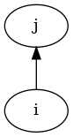

# Using Panda Compiler

A ```main.py``` file has been created in the outer folder that makes it possible to easily interact with the compiler located in ```src/```. 

The main file handles the instantiation and therefore also the running of the ```PandaCompiler``` class. ```Argparse``` is used to take command line arguments. 

Running the follow command,

```
$ python3.10 main.py --help

usage: Compiler for Panda [-h] [-o OUTPUT] [-c] [-d] [-f FILE] [-t] [-r]

Compiles source code to assembly

options:
  -h, --help            show this help message and exit
  -o OUTPUT, --output OUTPUT
                        Specify name of assembly output file
  -c, --compile         Set this flag if the output file should be compilled with gcc
  -d, --debug           Set this flag for debugging information, i.e., ILOC and Graphviz
  -f FILE, --file FILE  Path to input file, otherwise stdin will be used
  -t, --runTests        Run tests
  -r, --run             Run compilled program
```

makes it possible to see what options are available.

# Project structure
The compiler is divided into phases and different functionality groupings. To give an overview of the project, the following file tree has been inserted. The tree does not give the complete picture of which files are in the project, but it shows the most essential.

```
src/
├─ dataclass/
│  ├─ AST.py
│  ├─ iloc.py
│  ├─ symbol.py
├─ enums/
│  ├─ code_generation_enum.py
│  ├─ symbols_enum.py
├─ phase/
│  ├─ code_generation_stack.py
│  ├─ emit.py
│  ├─ lexer.py
│  ├─ parser.py
│  ├─ symbol_collection.py
│  ├─ syntactic_desugaring.py
├─ printer/
│  ├─ ast_printer.py
│  ├─ generic_printer.py
│  ├─ symbol_printer.py
├─ .../
├─ compiler.py
├─ ...
```

# Debugging
For debugging reasons, it was chosen to develop some printers for the syntax trees, to be able to see the structure of the program graphically.

Debugging can be executed as follows:
```
$ python3.10 main.py --debug
```

## Abstract syntax tree
A picture of the raw AST is inserted below.


## De-sugared Abstract Syntax Tree
In case of occurrences of ```<type><name>=<exp>```, it has been necessary to perform some de-sugaring, which is why the tree is transformed into the following.


## Symbol Table
The following is just an image of which variables are in which scopes, so that it could be checked that symbols were collected correctly.



# Testing
```Unittest```, which is a python module, has been actively used to test whether the compiler works correctly. It is particularly useful when one want to further develop the compiler, or for some other reason have to make changes. By running the tests, one can ensure that no bugs were introduced by the changes before merging.

To ensure that the tests are comprehensive, coverage is a good measure. However, it is important to remember that one can easily achieve 100% coverage without good tests if one is not careful.

## Unittest
Unit tests are run as follows:
```
$ python3.10 main.py --runTests

runTest (testing.test.TestCase)
Testing testing/test-cases/assignment.panda ... ok
runTest (testing.test.TestCase)
Testing testing/test-cases/declaration_init_function.panda ... ok
runTest (testing.test.TestCase)
Testing testing/test-cases/fibonacci_classic.panda ... ok
...
runTest (testing.test.TestCase)
Testing testing/test-cases/statement-while.panda ... ok
runTest (testing.test.TestCase)
Testing testing/test-cases/static_nested_scope.panda ... ok
runTest (testing.test.TestCase)
Testing testing/test-cases/summers.panda ... ok

----------------------------------------------------------------------
Ran 21 tests in 2.261s

OK
```

## Coverage
Test coverage can be checked by running the following command:
```
$ python3.10 -m coverage run main.py --runTests -d

Name                                     Stmts   Miss  Cover
------------------------------------------------------------
main.py                                     21      1    95%
src/compiler.py                             54      3    94%
src/dataclass/AST.py                       125      0   100%
src/dataclass/iloc.py                       22      0   100%
src/dataclass/symbol.py                     34      2    94%
src/enums/code_generation_enum.py           38      0   100%
src/enums/symbols_enum.py                    5      0   100%
src/phase/code_generation_stack.py         231      3    99%
src/phase/emit.py                          128      6    95%
src/phase/lexer.py                          44      8    82%
src/phase/parser.py                        101      3    97%
src/phase/parsetab.py                       18      0   100%
src/phase/symbol_collection.py              86      0   100%
src/phase/syntactic_desugaring.py           65      0   100%
src/printer/ast_printer.py                 141      3    98%
src/printer/generic_printer.py              17      0   100%
src/printer/symbol_printer.py               40      0   100%
src/utils/error.py                           5      0   100%
src/utils/interfacing_parser.py              1      0   100%
src/utils/label_generator.py                 9      0   100%
src/utils/x86_instruction_enum_dict.py       2      0   100%
testing/test.py                             73      0   100%
------------------------------------------------------------
TOTAL                                     1260     29    98%
Wrote HTML report to htmlcov/index.html
```