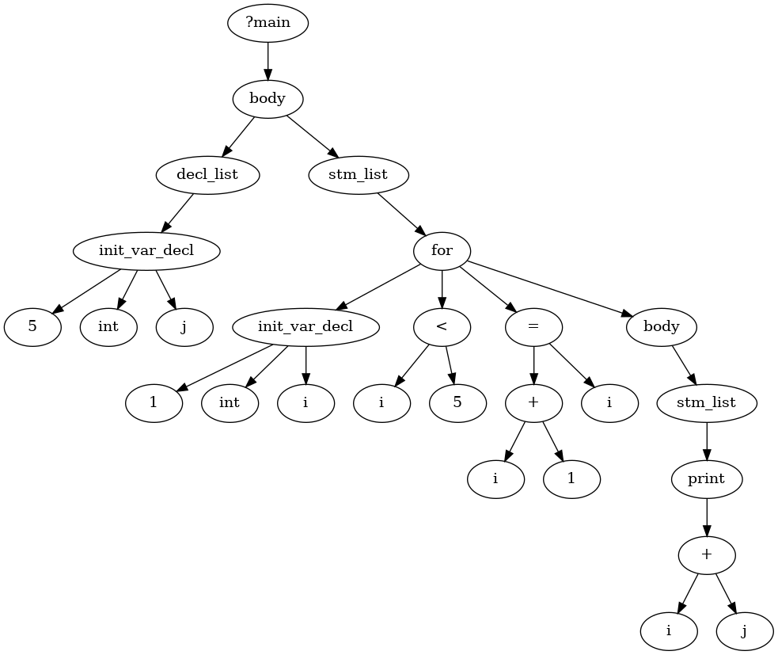

# Using Panda Compiler

A ```main.py``` file has been created in the outer folder that makes it possible to easily interact with the compiler located in ```src/```. 

The main file handles the instantiation and therefore also the running of the ```PandaCompiler``` class. ```Argparse``` is used to take command line arguments. 

Running the follow command,

```
$ python3.10 main.py --help

usage: Compiler for Panda [-h] [-o OUTPUT] [-c] [-d] [-f FILE] [-t] [-r]

Compiles source code to assembly

options:
  -h, --help            show this help message and exit
  -o OUTPUT, --output OUTPUT
                        Specify name of assembly output file
  -c, --compile         Set this flag if the output file should be compilled with gcc
  -d, --debug           Set this flag for debugging information, i.e., ILOC and Graphviz
  -f FILE, --file FILE  Path to input file, otherwise stdin will be used
  -t, --runTests        Run tests
  -r, --run             Run compilled program
```

makes it possible to see what options are available.

# The compiler

## AST


## AST de-sugared


## Symbol Table


# Testing